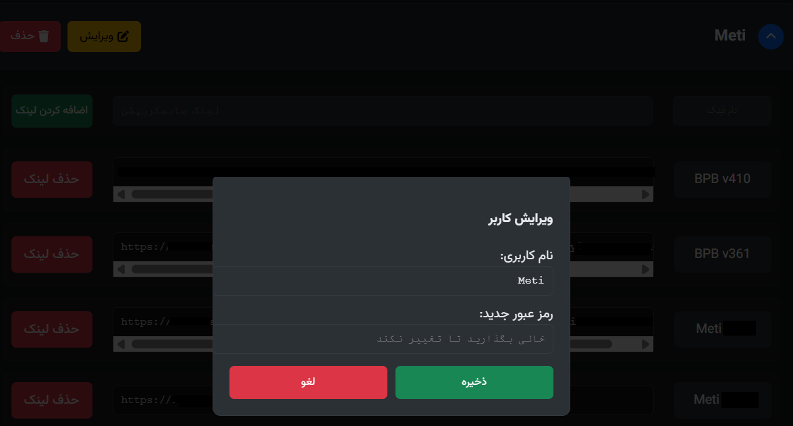
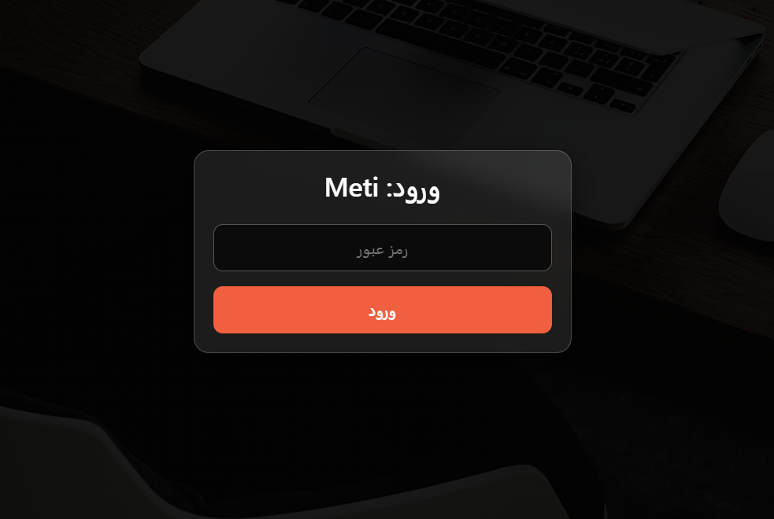
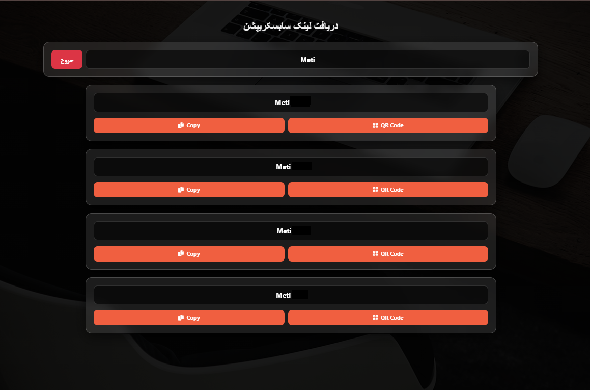

# 🚀 سیستم مدیریت لینک‌های ساب‌اسکریپشن

این پروژه یک سیستم سبک، سریع و امن برای مدیریت کاربران و لینک‌های اشتراک (Subscription Links) کانفیگ‌های V2Ray، Xray و سایر پروتکل‌ها است. این سیستم با زبان **PHP** نوشته شده و از دیتابیس **SQLite** استفاده می‌کند، به این معنی که نیاز به هیچ تنظیمات پیچیده‌ی دیتابیسی (مثل MySQL) ندارد و روی اکثر هاست‌های رایگان و اشتراکی به راحتی اجرا می‌شود.

---

## ✨ ویژگی‌ها (Features)

### 👤 پنل کاربران (User Panel)
*   **طراحی واکنش‌گرا (Mobile-First):** رابط کاربری کاملاً بهینه برای موبایل و دسکتاپ.
*   **طراحی مدرن:** استفاده از استایل شیشه‌ای (Glassmorphism) و تم تیره (Dark Mode).
*   **نمایش لینک‌ها:** نمایش لیست کانفیگ‌ها به صورت کارت‌های مجزا.
*   **ابزارهای سریع:** دکمه‌های **کپی (Copy)** و **QR Code** برای هر لینک به صورت جداگانه.
*   **امنیت:** هر کاربر برای ورود به پنل اختصاصی خود نیاز به رمز عبور دارد.

### 🛡️ پنل مدیریت (Admin Panel)
*   **مدیریت کاربران:** امکان افزودن، ویرایش و حذف کاربران.
*   **مدیریت لینک‌ها:** افزودن بی‌نهایت لینک برای هر کاربر، حذف لینک‌ها.
*   **جستجوی سریع:** مرتب‌سازی خودکار لیست کاربران و لینک‌ها.
*   **رابط کاربری تمیز:** استفاده از تب‌بندی و لیست‌های آکاردئونی برای جلوگیری از شلوغی صفحه.
*   **امنیت:** صفحه ورود اختصاصی برای مدیر.

### ⚙️ فنی و زیرساخت
*   **بدون نیاز به نصب دیتابیس:** استفاده از **SQLite** (دیتابیس فقط یک فایل است که خودکار ساخته می‌شود).
*   **لینک‌های تمیز (Clean URLs):** استفاده از `.htaccess` برای حذف پسوند `.php` از آدرس‌ها.
*   **سبک و سریع:** بدون استفاده از فریم‌ورک‌های سنگین، فقط PHP خالص و JS ساده.

---

## 🛠️ پیش‌نیازها

*   هاست لینوکس با وب‌سرور Apache (برای پشتیبانی از `.htaccess`).
*   **PHP نسخه 8.0** یا بالاتر.
*   افزونه‌های PHP: `pdo_sqlite` (که روی ۹۹٪ هاست‌ها فعال است).

---

## 🚀 آموزش نصب و راه‌اندازی (Deployment)

این پروژه برای اجرا روی هاست‌های رایگان مثل **InfinityFree** کاملاً بهینه شده است.

### نصب روی InfinityFree (و سایر هاست‌های مشابه)

1.  **دانلود فایل‌ها:** تمام فایل‌های این مخزن را دانلود کنید.
2.  **ورود به فایل منیجر:** وارد پنل هاست خود شوید و `File Manager` را باز کنید.
3.  **پوشه اصلی:**
    *   در **InfinityFree** وارد پوشه `htdocs` شوید.
    *   در هاست های دارای سی‌پنل وارد پوشه `public_html` شوید.
4.  **پاکسازی:** فایل‌های پیش‌فرض موجود (مثل `index2.html` یا `default.php`) را حذف کنید.
5.  **آپلود:** تمام فایل‌های پروژه (`admin.php`, `user.php`, `login.php`, `style.css`, `admin.css` و ...) را آپلود کنید.
6.  **فایل `.htaccess`:** مطمئن شوید فایل `.htaccess` حتماً آپلود شده باشد (این فایل معمولاً مخفی است، مطمئن شوید تنظیمات نمایش فایل‌های مخفی روشن باشد).
7.  **تصویر پس‌زمینه:** یک تصویر زیبا با نام `bg.jpg` در کنار فایل‌ها آپلود کنید.

---

## 📖 نحوه استفاده

### ۱. ورود اولیه
بعد از آپلود فایل‌ها، آدرس سایت خود را در مرورگر وارد کنید و به مسیر `/login` بروید:
`https://your-site.com/login`

*   **نام کاربری پیش‌فرض:** `admin`
*   **رمز عبور پیش‌فرض:** `123456`

> ⚠️ **مهم:** بلافاصله پس از اولین ورود، به دیتابیس یا کد مراجعه کنید و رمز عبور ادمین را تغییر دهید (یا در پنل ادمین یوزر admin را ویرایش کنید).

### ۲. ساخت کاربر
1.  در پنل ادمین، به تب **"افزودن کاربر"** بروید.
2.  نام کاربری و رمز عبور دلخواه برای کاربر را وارد کنید.
3.  دکمه **"ساخت کاربر"** را بزنید.

### ۳. افزودن لینک به کاربر
1.  در تب **"لیست کاربران"**، روی نام کاربر کلیک کنید تا لیست باز شود.
2.  در کادر "نام لینک" (مثلاً: همراه اول) و کادر "لینک" (مثلاً: `vless://... یا لینک سابسکریپشن`) را پر کنید.
3.  دکمه **"اضافه کردن لینک"** (سبز رنگ) را بزنید.

### ۴. تحویل به کاربر
لینک اختصاصی کاربر به صورت زیر است:
`https://your-site.com/u/USERNAME`

(به جای `USERNAME` نام کاربری‌ای که ساختید را قرار دهید). کاربر با باز کردن این لینک و وارد کردن رمز عبور خود، به کانفیگ‌ها دسترسی خواهد داشت.

---

## 📂 ساختار فایل‌ها

*   `admin.php`: پنل مدیریت برای ساخت یوزر و لینک.
*   `user.php`: پنل سمت کاربر برای مشاهده لینک‌ها.
*   `login.php`: صفحه ورود (هم برای ادمین، هم ریدایرکت).
*   `db.php`: تنظیمات اتصال به دیتابیس SQLite و ساخت خودکار جداول.
*   `style.css`: استایل‌های عمومی و پنل کاربر (Glassmorphism).
*   `admin.css`: استایل‌های اختصاصی پنل مدیریت.
*   `.htaccess`: تنظیمات بازنویسی آدرس‌ها (Rewrite Rules).
*   `logout.php`: اسکریپت خروج از حساب.

---

---

## 📸 اسکرین‌شات‌ها (Screenshots)

<table>
  <tr>
    <td width="50%">
      
    </td>
    <td width="50%">
      
    </td>
  </tr>
  <tr>
    <td width="50%">
      
    </td>
    <td width="50%">
      
    </td>
  </tr>
   <tr>
    <td width="50%">
      
    </td>
    <td width="50%">
      
    </td>
  </tr>
</table>

## ❤️ حمایت و توسعه

این پروژه با هدف ساده‌سازی اشتراک‌گذاری کانفیگ‌ها طراحی شده است. اگر این پروژه برای شما مفید بود، می‌توانید با دادن ⭐️ (Star) در گیت‌هاب از آن حمایت کنید.

**Made with Love & PHP**
