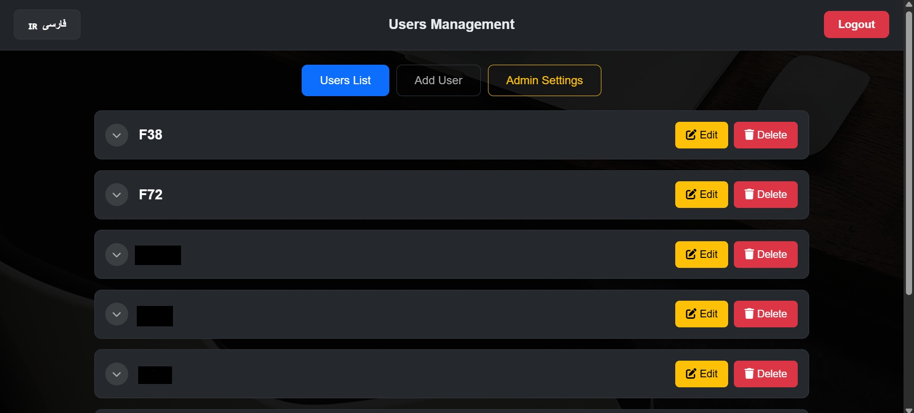
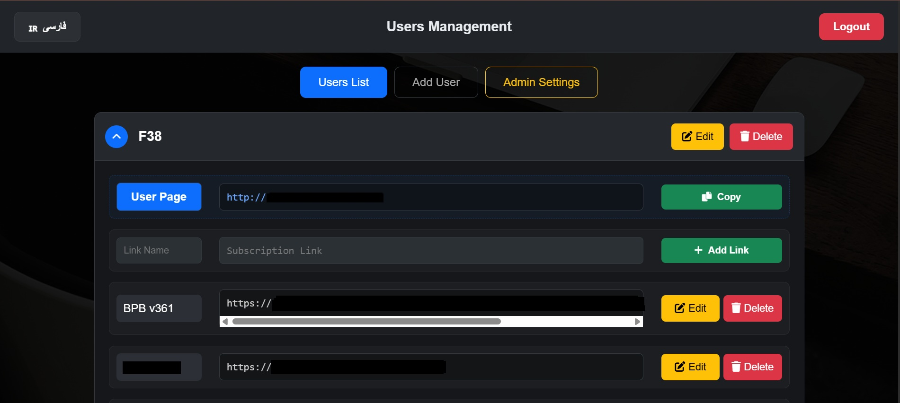
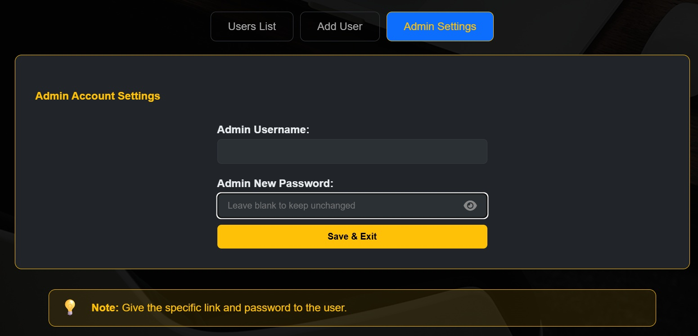
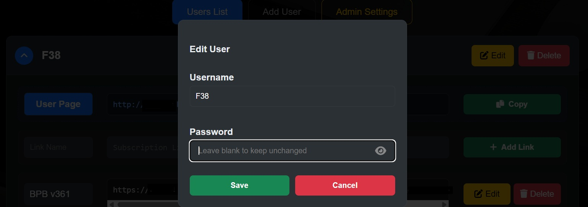
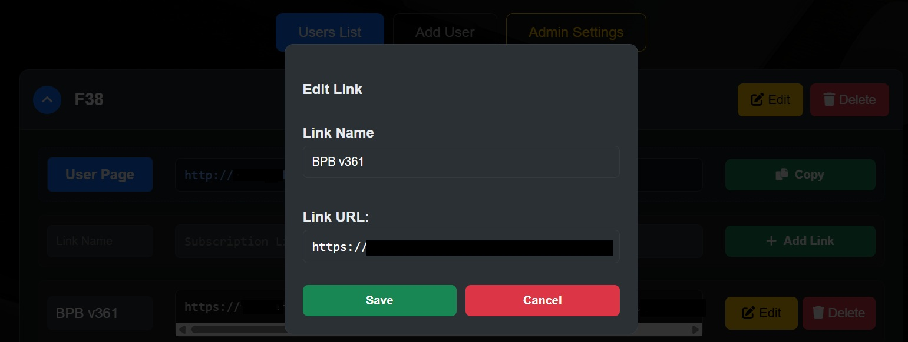
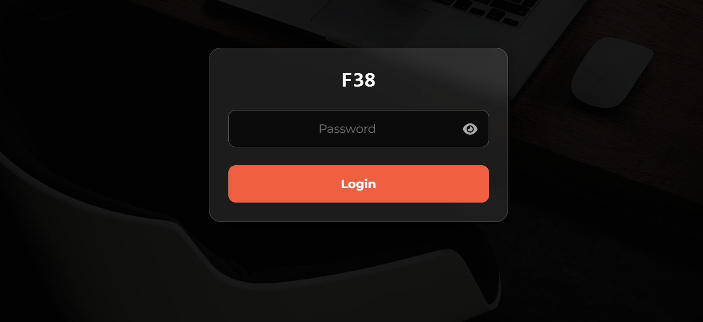
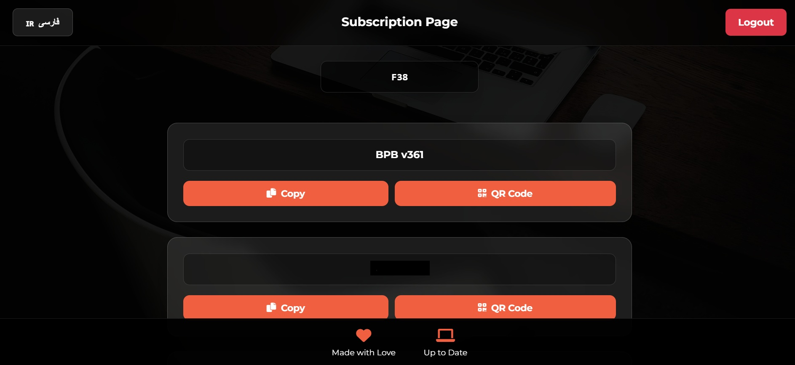

   

# 🚀 سیستم مدیریت لینک‌های ساب‌اسکریپشن 🚀      

این پروژه یک سیستم سبک، سریع و امن برای مدیریت کاربران و لینک‌های اشتراک (Subscription Links) کانفیگ‌های V2Ray، Xray و سایر پروتکل‌ها است. این سیستم با زبان **PHP** نوشته شده و از دیتابیس **SQLite** استفاده می‌کند، به این معنی که نیاز به هیچ تنظیمات پیچیده‌ی دیتابیسی (مثل MySQL) ندارد و روی اکثر هاست‌های رایگان و اشتراکی به راحتی اجرا می‌شود.

---

## ✨ ویژگی‌ها (Features)

### 👤 پنل کاربران (User Panel)
*   **طراحی واکنش‌گرا (Mobile-First):** رابط کاربری کاملاً بهینه برای موبایل و دسکتاپ.
*   **طراحی مدرن:** استفاده از استایل شیشه‌ای (Glassmorphism) و تم تیره (Dark Mode).
*   **نمایش لینک‌ها:** نمایش لیست کانفیگ‌ها به صورت کارت‌های مجزا و زیبا.
*   **ابزارهای سریع:** دکمه‌های **کپی (Copy)** و **QR Code** برای هر لینک به صورت جداگانه.
*   **امنیت:** هر کاربر برای ورود به پنل اختصاصی خود نیاز به رمز عبور دارد.

### 🛡️ پنل مدیریت (Admin Panel)
*   **پشتیبانی از دو زبان (Dual Language):** پنل مدیریت کاملاً دو زبانه (فارسی/RTL و انگلیسی/LTR).
*   **داشبورد تب‌بندی شده:** تفکیک لیست کاربران، افزودن کاربر جدید و تنظیمات مدیریت با رابط کاربری یکپارچه.
*   **ویرایش کامل کاربران و لینک‌ها:** امکان تغییر نام و رمز عبور کاربران و همچنین **ویرایش مستقیم نام و آدرس لینک‌های ثبت‌شده** (بدون نیاز به حذف و ساخت مجدد).
*   **باکس لینک هوشمند (Smart Link):** تولید خودکار لینک اختصاصی هر کاربر بر اساس دامنه فعلی و قابلیت کپی سریع برای تحویل به کاربر.
*   **آکاردئون پیشرفته و هوشمند:** نمایش لینک‌های هر کاربر در کشوهای بازشونده. به کمک جاوا اسکریپت (SessionStorage)،.
*   **تنظیمات حساب مدیریت:** تب اختصاصی برای تغییر نام و رمز عبور ادمین مستقیماً از داخل پنل.
*   **مرتب‌سازی خودکار:** لیست کاربران به صورت حروف الفبا (A-Z) برای دسترسی سریع‌تر مرتب می‌شود.

### ⚙️ فنی و زیرساخت
*   **بدون نیاز به نصب دیتابیس:** استفاده از **SQLite** (دیتابیس فقط یک فایل است که خودکار ساخته می‌شود).
*   **لینک‌های تمیز (Clean URLs):** استفاده از `.htaccess` برای حذف پسوند `.php` از آدرس‌ها.
*   **سبک و سریع:** بدون استفاده از فریم‌ورک‌های سنگین، فقط PHP خالص و CSS/JS بومی.

---

## 🛠️ پیش‌نیازها

*   هاست لینوکس با وب‌سرور Apache (برای پشتیبانی از `.htaccess`).
*   **PHP نسخه 8.0** یا بالاتر.
*   افزونه‌های PHP: `pdo_sqlite` (که روی ۹۹٪ هاست‌ها فعال است).

---

## 🚀 آموزش نصب و راه‌اندازی (Deployment)

این پروژه برای اجرا روی هاست‌های رایگان مثل **InfinityFree** کاملاً بهینه شده است.

### نصب روی InfinityFree (و سایر هاست‌های مشابه)

1.  **دانلود فایل‌ها:** تمام فایل‌های این مخزن را دانلود کنید.
2.  **ورود به فایل منیجر:** وارد پنل هاست خود شوید و `File Manager` را باز کنید.
3.  **پوشه اصلی:**
    *   در **InfinityFree** وارد پوشه `htdocs` شوید.
    *   در هاست‌های دارای سی‌پنل وارد پوشه `public_html` شوید.
4.  **پاکسازی:** فایل‌های پیش‌فرض موجود (مثل `index2.html` یا `default.php`) را حذف کنید.
5.  **آپلود:** تمام فایل‌های پروژه (`admin.php`, `user.php`, `login.php`, `lang.php`, `style.css`, `admin.css` و ...) را آپلود کنید.
6.  **فایل `.htaccess`:** مطمئن شوید فایل `.htaccess` حتماً آپلود شده باشد (این فایل معمولاً مخفی است، مطمئن شوید تنظیمات نمایش فایل‌های مخفی روشن باشد).
7.  **تصویر پس‌زمینه:** یک تصویر زیبا با نام `bg.jpg` در کنار فایل‌ها آپلود کنید.

---

## 📖 نحوه استفاده

### ۱. ورود اولیه
بعد از آپلود فایل‌ها، آدرس سایت خود را در مرورگر وارد کنید و به مسیر `/login` بروید:
`https://your-site.com/login`

*   **نام کاربری پیش‌فرض:** `admin`
*   **رمز عبور پیش‌فرض:** `123456`

> ⚠️ **مهم:** بلافاصله پس از اولین ورود، به تب "تنظیمات ادمین" بروید و رمز عبور پیش‌فرض را تغییر دهید.

### ۲. ساخت کاربر
1.  در پنل ادمین، به تب **"افزودن کاربر"** بروید.
2.  نام کاربری و رمز عبور دلخواه برای کاربر را وارد کنید.
3.  دکمه **"ساخت کاربر"** را بزنید.

### ۳. مدیریت لینک‌ها
1.  در تب **"لیست کاربران"**، روی نام کاربر کلیک کنید تا پنل او باز شود.
2.  برای افزودن لینک جدید، در کادر "نام لینک" و "لینک سابسکریپشن" مقادیر را پر کرده و **"اضافه کردن لینک"** را بزنید.
3.  برای تغییر لینک‌های موجود، می‌توانید از دکمه‌های **"ویرایش" (زرد رنگ)** و **"حذف" (قرمز رنگ)** در کنار هر لینک استفاده کنید.

### ۴. تحویل به کاربر
لینک اختصاصی کاربر به صورت زیر است (در بالاترین قسمت پنل هر کاربر نیز قرار داده شده است):
`https://your-site.com/u/USERNAME`

کاربر با باز کردن این لینک و وارد کردن رمز عبور خود، به کانفیگ‌ها دسترسی خواهد داشت.

---

## 📂 ساختار فایل‌ها

*   `admin.php`: پنل مدیریت برای ساخت یوزر، مدیریت لینک‌ها و تنظیمات ادمین.
*   `user.php`: پنل سمت کاربر برای مشاهده لینک‌ها، کپی و دریافت QR Code.
*   `login.php`: صفحه ورود امن برای مدیریت.
*   `lang.php`: سیستم ترجمه و مدیریت زبان‌های پنل (فارسی/انگلیسی).
*   `db.php`: تنظیمات اتصال به دیتابیس SQLite و ساخت خودکار جداول.
*   `style.css`: استایل‌های عمومی سایت و پنل شیشه‌ای کاربر.
*   `admin.css`: استایل‌های اختصاصی و ریسپانسیو پنل مدیریت.
*   `.htaccess`: تنظیمات بازنویسی آدرس‌ها و امنیت دیتابیس.
*   `logout.php`: اسکریپت خروج امن از حساب.

---

## 📸 اسکرین‌شات‌ها (Screenshots)

<table>
  <tr>
    <td width="50%">
      
    </td>
    <td width="50%">
      
    </td>
  </tr>
  <tr>
    <td width="50%">
      
    </td>
    <td width="50%">
      
    </td>
  </tr>
    <tr>
    <td width="50%">
      
    </td>
    <td width="50%">
      
    </td>
  </tr>
   <tr>
    <td width="50%">
      
    </td>
    <td width="50%">
      
    </td>
  </tr>
</table>

## ❤️ حمایت و توسعه

این پروژه با هدف ساده‌سازی، زیبایی و امنیت در اشتراک‌گذاری کانفیگ‌ها طراحی شده است. اگر این سیستم برای شما مفید بود، می‌توانید با دادن ⭐️ (Star) در گیت‌هاب از آن حمایت کنید.
  **Made with Love & PHP**  
